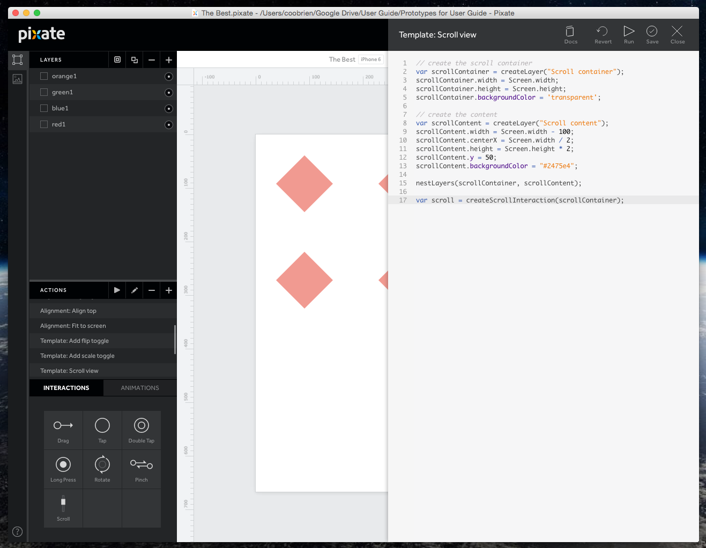
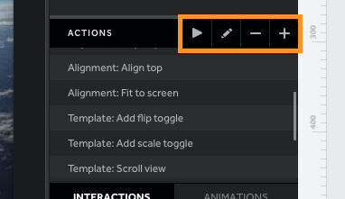
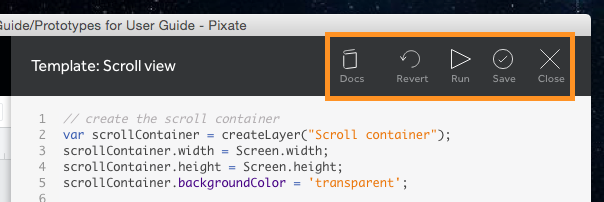
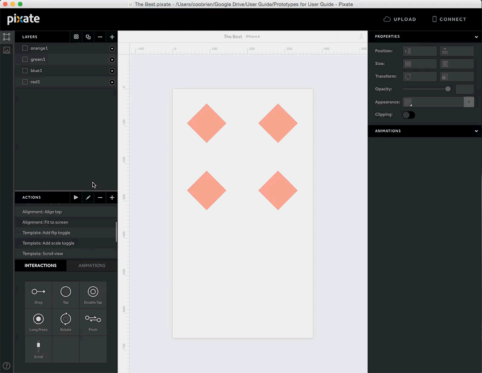

# Actions

在 Studio中，Actions 是自动化脚本。action 可以与 layer 相配合来制作一整套的 UI 组件或者 behavior。Pixate 提供了一些列默认的 action 来供您使用。但是你可以自行创建你自己的 action，或者去 [Pixate Community](htp://community.pixate.com/c/actions) 找到分享出来的好用的 action。

Actions are scripts that can automatically manipulate everything in the Studio. An action can do anything from align a layer to create an entire UI component or behavior. Pixate provides a set of default actions for you to use, but we give you the tools to create your own or find useful ones shared in the [Pixate Community](http://community.pixate.com/c/actions).

*现在 action 仍然处于测试版本，使用测试版本来尝试 action，或者使用原型的拷贝。*

*Actions are currently in beta, so please try them out first on a dummy prototype, or duplicate your prototype first*.

## Action pane

action 面板

这个列表展示了你账户上现有的 actions。账户上所列出的 action，你都可以使用它来为团队设计个好方案。

This section lists the actions you have in your account. These will be available to all users in your account, making this ideal for teams.

  

- **play** 按钮，用以完整执行一个 action。

- **pencil** 按钮，打开编辑器，对选中的 action 进行编辑。

- **minus** 按钮，删除选中的按钮。

- **plus** 按钮，创建一个新的 action。

* The **play** button, runs the action from start to finish.

* The **pencil** icon opens the editor, allowing you to edit the selected action.

* The **minus** button deletes the selected action.

* The **plus** button creates a new action.

## Action editor

action 编辑器

action 编辑器可以创建和编辑你的 action。

This is where you build and edit your actions.

  

- **Docs** 按钮，打开 API 的帮助文档。

- **Undo** 按钮，撤销最后执行的 action。

    用于测试的好方式，可以先执行一个 action，查看效果，撤销 action，进行对比。在必要时进行执行和撤销。

- **Run** 按钮，执行一个完整的 action。

- **Save** 按钮，保存 action。

- **Close** 按钮，关闭编辑器窗口。

* The **Docs** button takes you to the API documentation.

* The **Undo** button, reverts the last action you ran.
 
    This is best used when testing. You can run the action to see the result, undo the action, make changes and run and undo again as needed.

* The **Run** button, runs the action from start to finish.

* The **Save** button saves your progress on the action.

* The **Close** button closes the editor window.

### ASTING AN ACTION

拓展 action

如果在我们的社区中找到了一个 action，并想将其添加到你的列表中，同复制脚本代码到编辑器中，便可轻而易举地创建一个新的 action 。

If you find an action in our community and want to add it to your list, you can easily create a new action and just paste the script into the editor.

向您账户中添加脚本的时候要注意，确保脚本代码的来源是可信，在执行脚本之前要仔细检查。

Be careful when adding scripts to your account. Make sure the script is from a trusted source and take a look at it before running it.

## Building your own actions

创建自己的 actions

action 是完全可定制的，所以完全可以编辑一个存在的 action或者新建一个。action 使用的是 JavaScript 的子集进行编写，如果你之前使用过 JavaScript，你会感觉很亲切。可以到我们的 [API docs](http://www.pixate.com/docs/actions/#introduction) 获取更多信息。

Actions are completely customizable, so you can edit existing ones or make your own. Actions are written with a subset of Javascript, so if you've used Javascript before you should feel right at home. Head on over to our [API docs](http://www.pixate.com/docs/actions/#introduction) to get started with your own actions.
