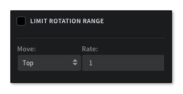
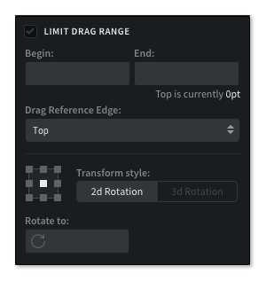
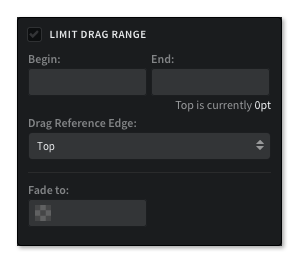
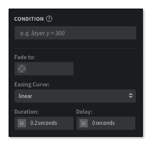
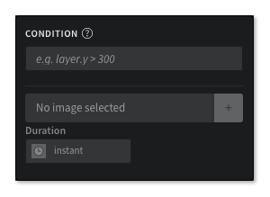
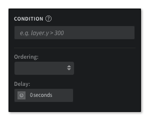

# Animation Properties

动画属性

每个动画，都有一组依赖于交互的属性以及动画模式。本章节将会介绍各个模块的使用方式。

Each animation has a different set of properties depending on the interaction and the animation mode chosen. This section will go over the options available in each animation mode.

## Move

移动

### Continuously to final value

持续不断到终值

*适用于拖拽，滚动，旋转和捏拉等交互*

*Applies to Drag Position, Scroll Position, Rotation and Pinch interactions*.

#### LIMIT BEGIN & END

此选项设置后，图层中的交互将会进行触发。必须设置起始点和终点。

These options set the limit or a range of the interaction in which the layer will move. The beginning and end points are required.

此动画是根据拖拽而设计的，可以指定图层的某条边作为参考，在滚动时，可以选择滚动的方向：水平和垂直。

Basing this animation on Drag Position will let you change which edge of the layer to use as the drag reference. Basing it on Scroll Position lets you pick which scroll direction: horizontal or vertical.

#### MOVE TO

图层的下拉边被用作参考，X 和 Y 字段指定了图层应该移动的位置。

The drop down changes which edge of the layer is used as reference. The fields are for the X and Y points the layer should move to.

**水平 参数**：

Left, Horizontal Center, Right

**垂直 参数**：

Top, Vertical Center, Bottom

**Horizontal options**: 

Left, Horizontal Center, Right

**Vertical options**: 

Top, Vertical Center, Bottom

### Continuously with rate

持续不断的速率

*适用于拖拽，滚动，旋转和捏拉等交互*

*Applies to Drag Position, Scroll Position, Rotation and Pinch interactions*.

#### LIMIT

此选项设置后，图层中的交互将会进行触发。在滚动区域内，如果想要移动图层，就会使用到。

These options set limits or a range of the interaction in which the layer will move. This would be used if you only want the layer to move within an area of a scroll.

此动画是根据拖拽而设计的，可以指定图层的某条边作为参考，在滚动时，可以选择滚动的方向：水平和垂直。

Basing this animation on Drag Position will let you change which edge of the layer to use as the drag reference. Basing it on Scroll Position lets you pick which scroll direction: horizontal or vertical.

#### MOVE

操作下拉列表，允许你修改区域内的参考图层。

This drop down allows you to change the area of the layer you want to use as reference.

**参数**：

Top, Right, Bottom, Left, Horizontal Center, Vertical Center

**Options**: 

Top, Right, Bottom, Left, Horizontal Center, Vertical Center

#### RATE

在图层移动时，改变了速率这个字段。在滚动交互中，根据这个动画，滚动的方向与速率值的正负相匹配。

This field changes the rate at which the layer moves. When basing this animation on a scroll interaction, a negative value can be used to match the scroll direction.

### With duration to final value

执行到终值的时间

*适用于所有的交互*

*Applies to all interactions*.

#### CONDITION

这个动画模式只是条件中的一个字段，动画会对其进行检查来决定采取什么 action。更多信息请查看 [Conditions](http://help.pixate.com/knowledgebase/articles/665635-3i-conditions)。

This animation mode is the only one that has a field for conditions. The animation will check these to see what action it will take. More on [Conditions](http://help.pixate.com/knowledgebase/articles/665635-3i-conditions).

#### MOVE TO

这个选项指明了图层要移动到什么地方。图层的下拉边被用作参考，X 和 Y 字段指定了图层应该移动的位置。

These options tell the layer where to move to. The drop down options are used to change the edge used as reference and the fields are for the X and Y positional values.

#### EASING CURVE

这就是你想要为动画使用的缓和曲线。

This is where you choose the easing curve you want to use for the animation.

#### DURATION

这个就是你定义的动画持续的时长。

This is where you define how long you want the animation to last, from start to finish.

持续时间和延时可以用来模拟链接动画的体验。

Duration and delay can be used to emulate the experience of chained animations.

#### DELAY

从动画开始时，设置延时。

Setting this will keep the animation from starting.

## Scale

缩放

### Continuously to final value

持续不断到终值

*适用于拖拽，滚动，旋转和捏拉等交互*

*Applies to Drag Position, Scroll Position, Rotation and Pinch interactions*.

#### LIMIT BEGIN & END

此选项设置后，图层中的交互将会进行触发。必须设置起始点和终点。

These options set the limit or a range of the interaction in which the layer will scale. The beginning and end points are required.

此动画是根据拖拽而设计的，可以指定图层的某条边作为参考，在滚动时，可以选择滚动的方向：水平和垂直。

Basing this animation on Drag Position will let you change which edge of the layer to use as the drag reference. Basing it on Scroll Position lets you pick which scroll direction: horizontal or vertical.

#### SCALE TYPE

下拉改变了用来缩放图层的方法：通过比例进行缩放或者缩放到指定的尺寸。

This drop down changes the method used to scale the layer: scale by factor or scale to specific size.

#### LINK X AND Y

这个选项选中后， x 或者 y 中的一个，一起缩放或者分别指定不同的值。

This option sets whether the X and Y values are scaled together or separately at different values.

#### ANCHOR

图层由九宫格进行分割。

The layer will scale from the selected tile in the 3 by 3 grid.

#### SCALE

通过比例或者指定尺寸来进行缩放。

This is the scale factor or specific size you want the layer to scale to.

### Continuously with rate

持续不断的速率

*适用于拖拽，滚动，旋转和捏拉等交互*

*Applies to Drag Position, Scroll Position, Rotation and Pinch interactions*.

#### LIMIT

此选项设置后，图层中的交互将会进行触发。在滚动区域内，如果想要移动图层，就会使用到。

These options set limits or a range of the interaction in which the layer will scale. This would be used if you only want the layer to scale within an area of a scroll.

此动画是根据拖拽而设计的，可以指定图层的某条边作为参考，在滚动时，可以选择滚动的方向：水平和垂直。

Basing this animation on Drag Position will let you change which edge of the layer to use as the drag reference. Basing it on Scroll Position lets you pick which scroll direction: horizontal or vertical.

#### ANCHOR

图层由九宫格进行分割。

The layer will scale from the selected tile in the 3 by 3 grid.

#### RATE

在图层移动时，改变了速率这个字段。在滚动交互中，根据这个动画，滚动的方向与速率值的正负相匹配。

This field changes the rate at which the layer scales. When basing this animation on a scroll interaction, a negative value can be used to match the scroll direction.

### With duration to final value

执行到终值的时间

*适用于所有的交互*

*Applies to all interactions*.

#### CONDITION

动画会对其进行检查来决定采取什么 action。更多信息请查看 [Conditions](http://help.pixate.com/knowledgebase/articles/665635-3i-conditions)。

The animation will check these to see what action it will take. More on [Conditions](http://help.pixate.com/knowledgebase/articles/665635-3i-conditions).

#### SCALE TYPE

下拉改变了用来缩放图层的方法：通过比例进行缩放或者缩放到指定的尺寸。

The drop down changes the method used to scale the layer: scale by factor or scale to specific size.

#### LINK X AND Y

这个选项选中后， x 或者 y 中的一个，一起缩放或者分别指定不同的值。

This option sets whether the X and Y values are scaled together or separately at different values.

#### ANCHORS

图层由九宫格进行分割。

The layer will scale from the selected tile in the 3 by 3 grid.

#### SCALE

通过比例或者指定尺寸来进行缩放。

This is the scale factor or specific size you want the layer to scale to.

#### EASING CURVE

这就是你想要为动画使用的缓和曲线。

This is where you choose the easing curve you want to use for the animation.

#### DURATION

这个就是你定义的动画持续的时长。

This is where you define how long you want the animation to last, from start to finish.

持续时间和延迟可以用来模拟链接动画的体验。

Duration and delay can be used to emulate the experience of chained animations.

#### DELAY

从动画开始时，设置延时。

Setting this will keep the animation from starting.

## Rotate

旋转

### Continuously to final value

持续不断到终值

*适用于拖拽，滚动，旋转和捏拉等交互*

*Applies to Drag Position, Scroll Position, Rotation and Pinch interactions*.

#### LIMIT BEGIN & END

此选项设置后，图层中的交互将会进行触发。必须设置起始点和终点。

These options set the limit or a range of the interaction in which the layer will rotate. The beginning and end points are required.

此动画是根据拖拽而设计的，可以指定图层的某条边作为参考，在滚动时，可以选择滚动的方向：水平和垂直。

Basing this animation on Drag Position will let you change which edge of the layer to use as the drag reference. Basing it on Scroll Position lets you pick which scroll direction: horizontal or vertical.

#### ANCHOR

图层由九宫格进行分割。

layer will rotate from the selected tile in the 3 by 3 grid.

#### TRANSFORM STYLE

这些按钮用来触发你想要的旋转样式。二维旋转是围绕 Z 轴的。三维旋转表明了要使用到额外的 x 和 y 轴。

These buttons are used to toggle which type of rotation you want to setup. 2D is rotation around the Z axis. 3D rotation reveals additional fields for X and Y axis rotation.

#### ROTATE TO

定义了图层将会旋转的角度。

This defines how far the layer will rotate, in degrees.

#### BACKSIDE LAYER

转换风格选中了三维旋转后，就会显示这个选项。图层的下拉列表中有允许将图层旋转到背面的选项。

This option is shown when 3D rotation is chosen for the transform style. The drop down will list layers available to be the backside of the layer with rotate.

### Continuously with rate

持续不断的速率

*适用于拖拽，滚动，旋转和捏拉等交互*

*Applies to Drag Position, Scroll Position, Rotation and Pinch interactions*.

#### LIMIT

此选项设置后，图层中的交互将会进行触发。在滚动区域内，如果想要移动图层，就会使用到。

These options set limits or a range of the interaction in which the layer will rotate. This would be used if you only want the layer to scale within an area of a scroll.

此动画是根据拖拽而设计的，可以指定图层的某条边作为参考，在滚动时，可以选择滚动的方向：水平和垂直。

Basing this animation on Drag Position will let you change which edge of the layer to use as the drag reference. Basing it on Scroll Position lets you pick which scroll direction: horizontal or vertical.

#### ANCHOR

图层由九宫格进行分割。

The layer will scale from the selected tile in the 3 by 3 grid.

#### TRANSFORM STYLE

这些按钮用来触发你想要的旋转样式。二维旋转是围绕 Z 轴的。三维旋转表明了要使用到额外的 X 和 Y 轴。

These buttons are used to toggle which type of rotation you want to setup. 2D is rotation around the Z axis. 3D rotation reveals additional fields for X and Y axis rotation.

#### RATE

在图层移动时，改变了速率这个字段。在滚动交互中，根据这个动画，滚动的方向与速率值的正负相匹配。

This field changes the rate at which the layer rotates. When basing this animation on a scroll interaction, a negative value can be used to match the scroll direction.

#### BACKSIDE LAYER

转换风格选中了三维旋转后，就会显示这个选项。图层的下拉列表中有允许将图层旋转到背面的选项。

This option is shown when 3D rotation is chosen for the transform style. The drop down will list layers available to be the backside of the layer with rotate.

### With duration to final value

执行到终值的时间

*适用于所有的交互*

*Applies to all interactions*.

#### CONDITION

动画会对其进行检查来决定采取什么 action。更多信息请查看 [Conditions](http://help.pixate.com/knowledgebase/articles/665635-3i-conditions)。

The animation will check these to see what action it will take. More on [Conditions](http://help.pixate.com/knowledgebase/articles/665635-3i-conditions).

#### ANCHOR

图层由九宫格进行分割。

The layer will scale from the selected tile in the 3 by 3 grid.

#### TRANSFORM STYLE

这些按钮用来触发你想要的旋转样式。二维旋转是围绕 Z 轴的。三维旋转表明了要使用到额外的 X 和 Y 轴。

These buttons are used to toggle which type of rotation you want to setup. 2D is rotation around the Z axis. 3D rotation reveals additional fields for X and Y axis rotation.

#### ROTATE TO

定义了图层将会旋转的角度。

This defines how far the layer will rotate, in degrees.

#### EASING CURVE

这就是你想要为动画使用的缓和曲线。

This is where you choose the easing curve you want to use for the animation.

#### DURATION

这个就是你定义的动画持续的时长。

This is where you define how long you want the animation to last, from start to finish.

持续时间和延迟可以用来模拟链接动画的体验。

Duration and delay can be used to emulate the experience of chained animations.

#### DELAY

从动画开始时，设置延时。

Setting this will keep the animation from starting.

#### BACKSIDE LAYER

转换风格选中了三维旋转后，就会显示这个选项。图层的下拉列表中有允许将图层旋转到背面的选项。

This option is shown when 3D rotation is chosen for the transform style. The drop down will list layers available to be the backside of the layer with rotate.

## Fade

淡入

### Continuously to final value

持续不断到终值

*适用于拖拽，滚动，旋转和捏拉等交互*

*Applies to Drag Position, Scroll Position, Rotation and Pinch interactions*.

#### LIMIT BEGIN & END

此选项设置后，图层中的交互将会进行触发。必须设置起始点和终点。

These options set the limit or a range of the interaction in which the layer will fade. The beginning and end points are required.

此动画是根据拖拽而设计的，可以指定图层的某条边作为参考，在滚动时，可以选择滚动的方向：水平和垂直。

Basing this animation on Drag Position will let you change which edge of the layer to use as the drag reference. Basing it on Scroll Position lets you pick which scroll direction: horizontal or vertical.

#### FADE TO

这个值是用来设置图层的透明度的。输入的是百分比。

This value sets the opacity of the layer. Values should be entered as a percentage.

### Continuously with rate

持续不断的速率

*适用于拖拽，滚动，旋转和捏拉等交互*

*Applies to Drag Position, Scroll Position, Rotation and Pinch interactions*.

#### LIMIT

此选项设置后，图层中的交互将会进行触发。在滚动区域内，如果想要移动图层，就会使用到。

These options set limits or a range of the interaction in which the layer will rotate. This would be used if you only want the layer to scale within an area of a scroll.

此动画是根据拖拽而设计的，可以指定图层的某条边作为参考，在滚动时，可以选择滚动的方向：水平和垂直。

Basing this animation on Drag Position will let you change which edge of the layer to use as the drag reference. Basing it on Scroll Position lets you pick which scroll direction: horizontal or vertical.

#### RATE

在图层移动时，改变了速率这个字段。在滚动交互中，根据这个动画，滚动的方向与速率值的正负相匹配。

This field changes the rate at which the layer fades. When basing this animation on a scroll interaction, a negative value can be used to match the scroll direction.

### With duration to final value

执行到终值的时间

*适用于所有的交互*

*Applies to all interactions*.

#### CONDITION

动画会对其进行检查来决定采取什么 action。更多信息请查看 [Conditions](http://help.pixate.com/knowledgebase/articles/665635-3i-conditions)。

The animation will check these to see what action it will take. More on [Conditions](http://help.pixate.com/knowledgebase/articles/665635-3i-conditions).

#### FADE TO

这个值是用来设置图层的透明度的。输入的是百分比。

This value sets the opacity of the layer. Values should be entered as a percentage.

#### EASING CURVE

这就是你想要为动画使用的缓和曲线。

This is where you choose the easing curve you want to use for the animation.

#### DURATION

这个就是你定义的动画持续的时长。

This is where you define how long you want the animation to last, from start to finish.

持续时间和延迟可以用来模拟链接动画的体验。

Duration and delay can be used to emulate the experience of chained animations.

#### DELAY

从动画开始时，设置延时。

Setting this will keep the animation from starting.

##Color

颜色

### With duration to final value

执行到终值的时间

*适用于所有的交互*

*Applies to all interactions*.

#### CONDITION

动画会对其进行检查来决定采取什么 action。更多信息请查看 [Conditions](http://help.pixate.com/knowledgebase/articles/665635-3i-conditions)。

The animation will check these to see what action it will take. More on [Conditions](http://help.pixate.com/knowledgebase/articles/665635-3i-conditions).

#### CHANGE COLOR TO

设置图层需要改变的 RGB 颜色值。

This is the RGB value of the color you want to change the layer to.

#### DURATION

持续时间是即时的，就是说没有从颜色到颜色的过渡。

As of right now, the only option for duration is instant. This means there's no transition from color to color.

## Image

图片

### With duration to final value

执行到终值的时间

*适用于所有的交互*

*Applies to all interactions*.

 

#### CONDITION

动画会对其进行检查来决定采取什么 action。更多信息请查看 [Conditions](http://help.pixate.com/knowledgebase/articles/665635-3i-conditions)。

The animation will check these to see what action it will take. More on [Conditions](http://help.pixate.com/knowledgebase/articles/665635-3i-conditions).

#### SELECT ASSET

用来选中要设置给图层的图片资源。这个图片资源必须已经上传到您的账号中。

Use this to choose the asset you want to apply to the layer. The asset must already be uploaded to your account.

#### DURATION

持续时间是即时的，就是说没有从图片到图片的过渡。

As of right now, the only option for duration is instant. This means the image will be applied instantly.

## Reorder

再排序

### With duration to final value

执行到终值的时间

*适用于所有的交互*

*Applies to all interactions*.

#### CONDITION

动画会对其进行检查来决定采取什么 action。更多信息请查看 [Conditions](http://help.pixate.com/knowledgebase/articles/665635-3i-conditions)。

The animation will check these to see what action it will take. More on [Conditions](http://help.pixate.com/knowledgebase/articles/665635-3i-conditions).

#### ORDERING

下拉列表中有图层重新排序的方向。

This drop down allows you to select which direction you want the layer to be reordered.

**选项**：

**Options**: 

Bring to front, Send to back, Place before, Place behind

#### DELAY

从动画开始时，设置延时。

Setting this will keep the animation from starting.
