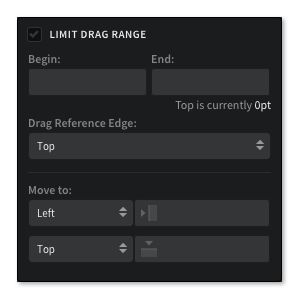
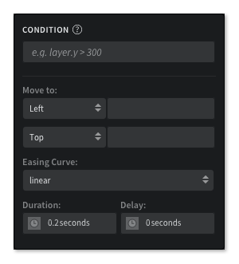
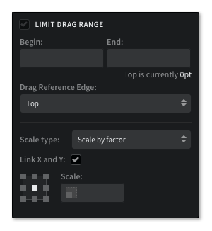
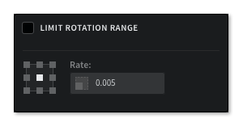
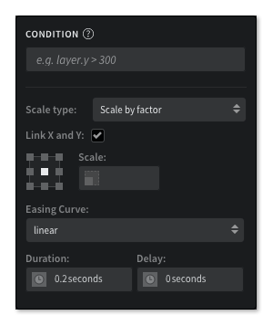
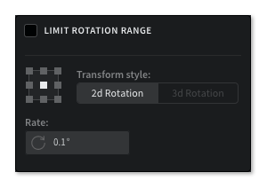
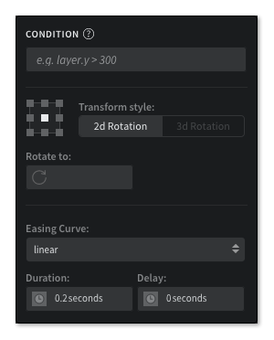
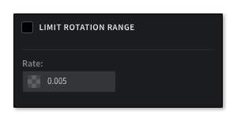
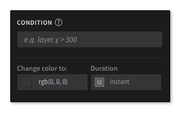

# 动画属性

每个动画，都有一组依赖于交互的属性以及动画模式。本章节将会介绍各个模块的使用方式。

## 移动

### C持续不断到终值

*适用于拖拽，滚动，旋转和捏拉等交互*

#### LIMIT BEGIN & END

此选项设置后，图层中的交互将会进行触发。必须设置起始点和终点。

此动画是根据拖拽而设计的，可以指定图层的某条边作为参考，在滚动时，可以选择滚动的方向：水平和垂直。

#### MOVE TO

图层的下拉边被用作参考，X 和 Y 字段指定了图层应该移动的位置。

**水平 参数**：

Left, Horizontal Center, Right

**垂直 参数**：

Top, Vertical Center, Bottom

### 持续不断的速率

*适用于拖拽，滚动，旋转和捏拉等交互*

#### LIMIT

此选项设置后，图层中的交互将会进行触发。在滚动区域内，如果想要移动图层，就会使用到。

此动画是根据拖拽而设计的，可以指定图层的某条边作为参考，在滚动时，可以选择滚动的方向：水平和垂直。

#### MOVE

操作下拉列表，允许你修改区域内的参考图层。

**参数**：

Top, Right, Bottom, Left, Horizontal Center, Vertical Center

#### RATE

在图层移动时，改变了速率这个字段。在滚动交互中，根据这个动画，滚动的方向与速率值的正负相匹配。

### 执行到终值的时间

*适用于所有的交互*

#### CONDITION

这个动画模式只是条件中的一个字段，动画会对其进行检查来决定采取什么 action。更多信息请查看 [Conditions](http://help.pixate.com/knowledgebase/articles/665635-3i-conditions)。

#### MOVE TO

这个选项指明了图层要移动到什么地方。图层的下拉边被用作参考，X 和 Y 字段指定了图层应该移动的位置。

#### EASING CURVE

这就是你想要为动画使用的缓和曲线。

#### DURATION

这个就是你定义的动画持续的时长。

持续时间和延时可以用来模拟链接动画的体验。

#### DELAY

从动画开始时，设置延时。

## 缩放

### 持续不断到终值

*适用于拖拽，滚动，旋转和捏拉等交互*

#### LIMIT BEGIN & END

此选项设置后，图层中的交互将会进行触发。必须设置起始点和终点。

此动画是根据拖拽而设计的，可以指定图层的某条边作为参考，在滚动时，可以选择滚动的方向：水平和垂直。

#### SCALE TYPE

下拉改变了用来缩放图层的方法：通过比例进行缩放或者缩放到指定的尺寸。

#### LINK X AND Y

这个选项选中后， x 或者 y 中的一个，一起缩放或者分别指定不同的值。

#### ANCHOR

图层由九宫格进行分割。

#### SCALE

通过比例或者指定尺寸来进行缩放。

### 持续不断的速率

*适用于拖拽，滚动，旋转和捏拉等交互*

#### LIMIT

此选项设置后，图层中的交互将会进行触发。在滚动区域内，如果想要移动图层，就会使用到。

此动画是根据拖拽而设计的，可以指定图层的某条边作为参考，在滚动时，可以选择滚动的方向：水平和垂直。

#### ANCHOR

图层由九宫格进行分割。

#### RATE

在图层移动时，改变了速率这个字段。在滚动交互中，根据这个动画，滚动的方向与速率值的正负相匹配。

### 执行到终值的时间

*适用于所有的交互*

#### CONDITION

动画会对其进行检查来决定采取什么 action。更多信息请查看 [Conditions](http://help.pixate.com/knowledgebase/articles/665635-3i-conditions)。

#### SCALE TYPE

下拉改变了用来缩放图层的方法：通过比例进行缩放或者缩放到指定的尺寸。

#### LINK X AND Y

这个选项选中后， x 或者 y 中的一个，一起缩放或者分别指定不同的值。

#### ANCHORS

图层由九宫格进行分割。

#### SCALE

通过比例或者指定尺寸来进行缩放。

#### EASING CURVE

这就是你想要为动画使用的缓和曲线。

#### DURATION

这个就是你定义的动画持续的时长。

持续时间和延迟可以用来模拟链接动画的体验。

#### DELAY

从动画开始时，设置延时。

## 旋转

### 持续不断到终值

*适用于拖拽，滚动，旋转和捏拉等交互*

#### LIMIT BEGIN & END

此选项设置后，图层中的交互将会进行触发。必须设置起始点和终点。

此动画是根据拖拽而设计的，可以指定图层的某条边作为参考，在滚动时，可以选择滚动的方向：水平和垂直。

#### ANCHOR

图层由九宫格进行分割。

#### TRANSFORM STYLE

这些按钮用来触发你想要的旋转样式。二维旋转是围绕 Z 轴的。三维旋转表明了要使用到额外的 x 和 y 轴。

#### ROTATE TO

定义了图层将会旋转的角度。

#### BACKSIDE LAYER

转换风格选中了三维旋转后，就会显示这个选项。图层的下拉列表中有允许将图层旋转到背面的选项。

### 持续不断的速率

*适用于拖拽，滚动，旋转和捏拉等交互*

#### LIMIT

此选项设置后，图层中的交互将会进行触发。在滚动区域内，如果想要移动图层，就会使用到。

此动画是根据拖拽而设计的，可以指定图层的某条边作为参考，在滚动时，可以选择滚动的方向：水平和垂直。

#### ANCHOR

图层由九宫格进行分割。

#### TRANSFORM STYLE

这些按钮用来触发你想要的旋转样式。二维旋转是围绕 Z 轴的。三维旋转表明了要使用到额外的 X 和 Y 轴。

#### RATE

在图层移动时，改变了速率这个字段。在滚动交互中，根据这个动画，滚动的方向与速率值的正负相匹配。

#### BACKSIDE LAYER

转换风格选中了三维旋转后，就会显示这个选项。图层的下拉列表中有允许将图层旋转到背面的选项。

### 执行到终值的时间

*适用于所有的交互*

#### CONDITION

动画会对其进行检查来决定采取什么 action。更多信息请查看 [Conditions](http://help.pixate.com/knowledgebase/articles/665635-3i-conditions)。

#### ANCHOR

图层由九宫格进行分割。

#### TRANSFORM STYLE

这些按钮用来触发你想要的旋转样式。二维旋转是围绕 Z 轴的。三维旋转表明了要使用到额外的 X 和 Y 轴。

#### ROTATE TO

定义了图层将会旋转的角度。

#### EASING CURVE

这就是你想要为动画使用的缓和曲线。

#### DURATION

这个就是你定义的动画持续的时长。

持续时间和延迟可以用来模拟链接动画的体验。

#### DELAY

从动画开始时，设置延时。

#### BACKSIDE LAYER

转换风格选中了三维旋转后，就会显示这个选项。图层的下拉列表中有允许将图层旋转到背面的选项。

## 淡入

### 持续不断到终值

*适用于拖拽，滚动，旋转和捏拉等交互*

#### LIMIT BEGIN & END

此选项设置后，图层中的交互将会进行触发。必须设置起始点和终点。

此动画是根据拖拽而设计的，可以指定图层的某条边作为参考，在滚动时，可以选择滚动的方向：水平和垂直。

#### FADE TO

这个值是用来设置图层的透明度的。输入的是百分比。

### 持续不断的速率

*适用于拖拽，滚动，旋转和捏拉等交互*

#### LIMIT

此选项设置后，图层中的交互将会进行触发。在滚动区域内，如果想要移动图层，就会使用到。

此动画是根据拖拽而设计的，可以指定图层的某条边作为参考，在滚动时，可以选择滚动的方向：水平和垂直。

#### RATE

在图层移动时，改变了速率这个字段。在滚动交互中，根据这个动画，滚动的方向与速率值的正负相匹配。

### 执行到终值的时间

*适用于所有的交互*

#### CONDITION

动画会对其进行检查来决定采取什么 action。更多信息请查看 [Conditions](http://help.pixate.com/knowledgebase/articles/665635-3i-conditions)。

#### FADE TO

这个值是用来设置图层的透明度的。输入的是百分比。

#### EASING CURVE

这就是你想要为动画使用的缓和曲线。

#### DURATION

这个就是你定义的动画持续的时长。

持续时间和延迟可以用来模拟链接动画的体验。

#### DELAY

从动画开始时，设置延时。

## 颜色

### 执行到终值的时间

*适用于所有的交互*

#### CONDITION

动画会对其进行检查来决定采取什么 action。更多信息请查看 [Conditions](http://help.pixate.com/knowledgebase/articles/665635-3i-conditions)。

#### CHANGE COLOR TO

设置图层需要改变的 RGB 颜色值。

#### DURATION

持续时间是即时的，就是说没有从颜色到颜色的过渡。

## 图片

### 执行到终值的时间

*适用于所有的交互*

 

#### CONDITION

动画会对其进行检查来决定采取什么 action。更多信息请查看 [Conditions](http://help.pixate.com/knowledgebase/articles/665635-3i-conditions)。

#### SELECT ASSET

用来选中要设置给图层的图片资源。这个图片资源必须已经上传到您的账号中。

#### DURATION

持续时间是即时的，就是说没有从图片到图片的过渡。

## 再排序

### 执行到终值的时间

*适用于所有的交互*

#### CONDITION

动画会对其进行检查来决定采取什么 action。更多信息请查看 [Conditions](http://help.pixate.com/knowledgebase/articles/665635-3i-conditions)。

#### ORDERING

下拉列表中有图层重新排序的方向。

**选项**：

Bring to front, Send to back, Place before, Place behind

#### DELAY

从动画开始时，设置延时。
