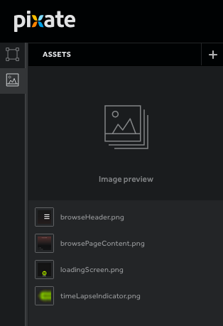
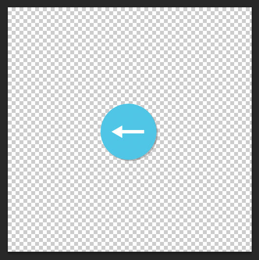
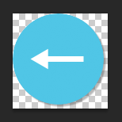

# 资源

虽然彩色方块可以展示一个精心设计的理念，但是图像可以更好的表达设计理念。资源是为原型创建图像的。资源可能包括菜单栏，按钮，文字或一个具体到您正在创建的程序模型内容。

可以通过点击左上角的选项卡打开 **Assets** 面板。

## 格式

Pixate 支持 **JPG**，**PNG** 和 **TIFF** 文件格式。提倡使用支持背景透明的 **PNG** 格式并尽可能的使用单元素。这样就可以定义比默认图层更丰富的形状。

最好的做法是，修剪或裁剪图像中多余的空间来获取更小的图像尺寸。例如，使用图片设计一个按钮。

我们强烈建议裁剪掉在图像中多余的空白区域，如下图所示。这将确保它不会影响其他层和交互，并保持程序的正常运行。若原型中数量较多的大图像，程序就会使用更多的多内存，影响用户体验。

Pixate 使用像素点作为计量单位，资源上传到你的原型后，就会改变的程序外观。

[关于更多点和像素的信息](http://pixate.uservoice.com/knowledgebase/articles/461806-2-high-level-concepts#PVP)

## 添加资源

单击 **+** 按钮，上传资源。这将打开资源管理器窗口，选择要上传的图片。或者，你可以从系统上的文件夹拖动图像放到 Pixate。资源上传时，资源缩略图的下方将出现蓝色进度条，说明上传正在进行中。

## 删除资源

要删除资源，将鼠标悬停在资源列表中某一项上，在右边的图标点击垃圾桶。这将从原型中移除该资源。
