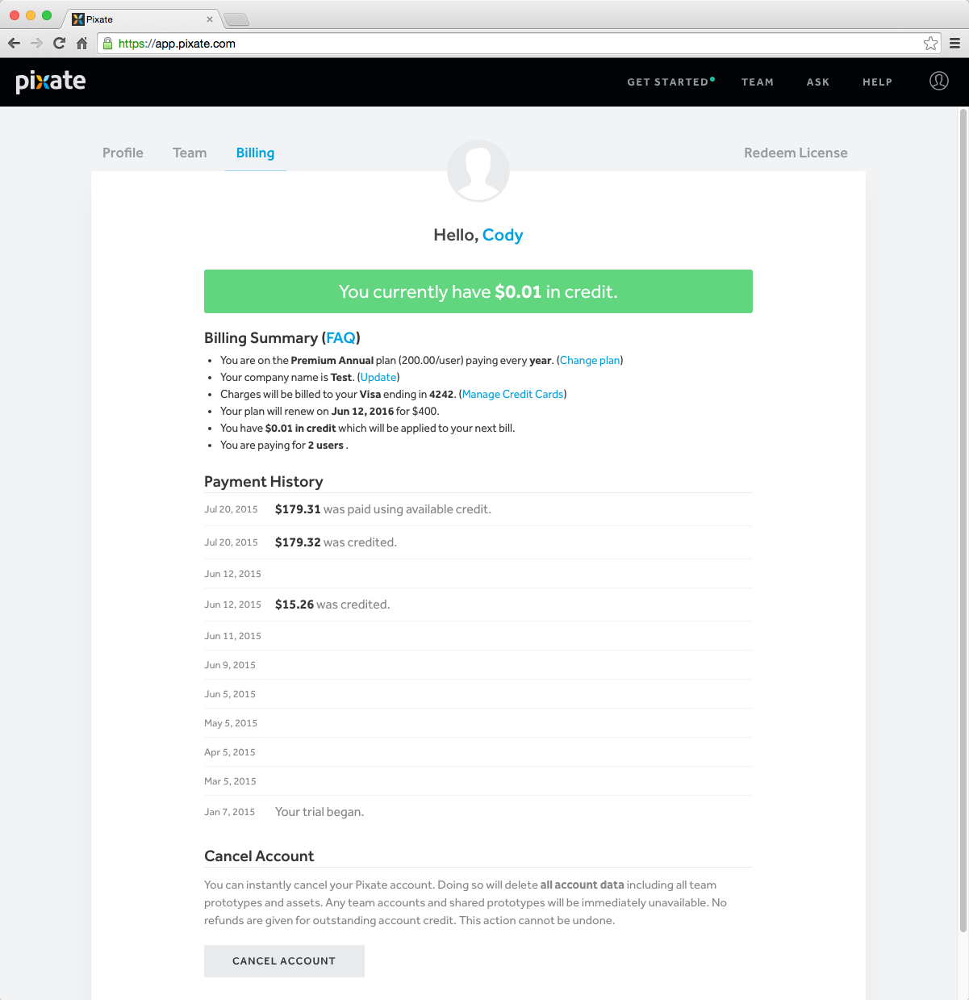

# 费用计算

账户所有者和客户经理（已经作为管理员）能够进入到账户的账单页。所有的费用计算操作都可以在这个页面中完成。

以下操作是可以被完成的：

- 检查和调整当前的订阅费用
- 检查和更改企业名称
- 管理与账户绑定的信用卡
- 检查和更改企业名称
- 检查更新日期，已在账户上申请的信用额度，以及您是按多少个用户来计算费用
- 删除账户

关于费用计算的具体问题，请使用您已注册的 Pixate 邮箱发送邮件至 [billing@pixate.com](mailto:billing@pixate.com)。

