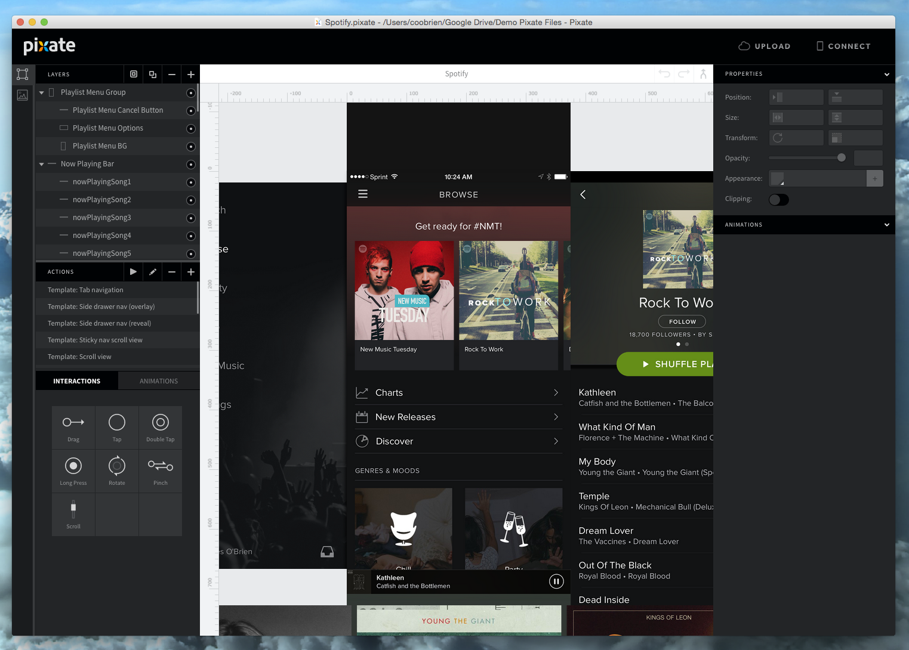
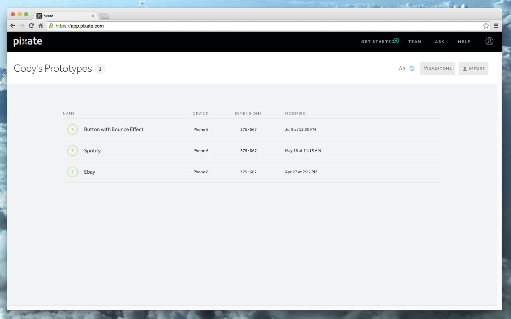
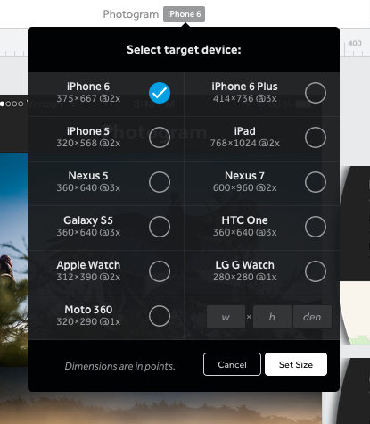

# 使用 Pixate 前需理解的概念

## 原生预览

Pixate 创建 100% 原生 APP 原型，可以直接在你的 iOS 或者 Android 设备上运行。工作的过程像这样：

1. 在 Pixate 中更改你的原型
2. 当保存完编辑之后，Pixate App 将在你的手机设备上即时生成或者刷新原型
3. 当前版本的原型可以在任何时候通过应用程序访问

Pixate 原型能够运行在原生的 iOS 和 Android 设备上，因为他们都是 100% 原生的。这可以让你构建复杂的原型并获得和你编写原生 Objective-C 或 Java 一致的体验，重要的是它不需要写任何代码。

下载 Pixate 的 [Android](https://play.google.com/store/apps/details?id=com.pixate.pixate&hl=en) 或者 [iOS](https://itunes.apple.com/us/app/pixate/id883304734?mt=8) App 就可以在你的设备上预览原型。

遇到连接的问题？可以查看[这个章节](http://help.pixate.com/knowledgebase/articles/665521-3a-connecting-your-devices)。

## 使用 Pixate

使用 Pixate 的过程将分为 2 个部分：使用 Studio 创建并编辑原型，在云端分享或者保存这个原型。

[Pixate Studio](http://help.pixate.com/knowledgebase/articles/665512-3-pixate-studio) 用于创建和编辑原型。这是一个可视化的编辑器，你可以用来创建图层，动画和交互。Studio 可以自动运行，因为它把所有文件本地存储在你的系统。

如果你想分享原型或者和团队成员合作，你将需要使用 [Pixate 的云端部分](http://help.pixate.com/knowledgebase/articles/665650-4-the-pixate-cloud)。这是使用 Pixate 的 “connected” 部分，它需要互联网连接和订阅。

## 点和像素

Pixate 使用点代替像素，所以尺寸和图像大小有一点点差异。点代表视图的大小和位置，和渲染的内容。这就能让一个图像可以在两个不同分辨率的不同设备显示，并没有视觉上的大小差异。

当你创建一个新的原型，你将看到密度（x2 和 x3）在设备屏幕大小后面。

当创建图像上传到 Pixate 的时候使用这个作为乘数。如果你创建一个 APP，使用的是 iPhone 6（x2），用点的尺寸乘以 2 就可以获得图像的像素尺寸。
