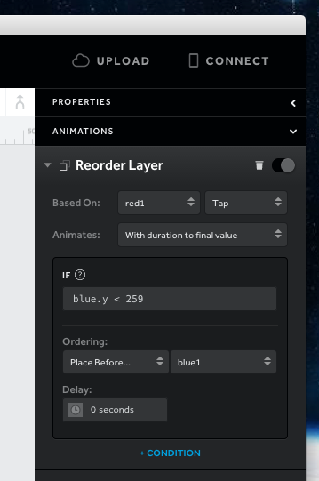
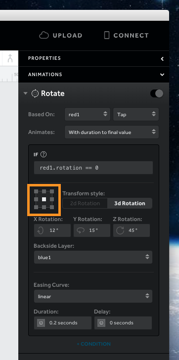
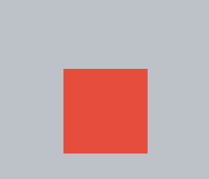
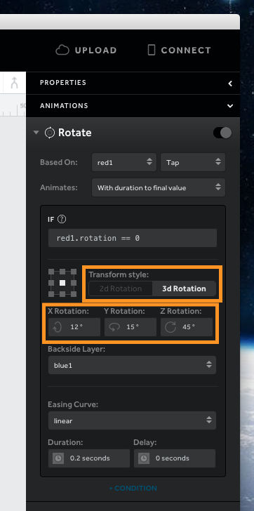
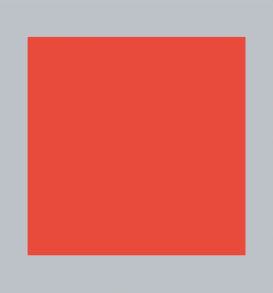
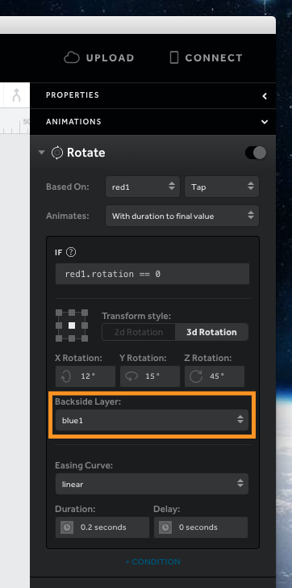

# 交互与动画属性

这些用来设置特定动画和交互，将其应用到图层。动画的范围和交互与动画的关系用来作为判断条件。

## 依据

第一个菜单项将动画设置给该图层。图层必须要有一个交互动作，才能在菜单中显示。建议使用简单的图层名称，易于使用。

每个交互动作都有不同的事件，第二个菜单项设置交互的事件到动画上。取决于事件，其他动画属性和选项可用或者被隐藏。

一层有多个交互，应用于它将显示所有可用选项。

这是交互事件的一个图表：

| 拖动	      |  位置  |  开始	 |  释放  |          |
| ----------- | :---------:| :---------: | :-------: | -------: |
| 点击	      | 点击	   | 	         |           |          |
| 双击         |       双击 |	 	 |           |          |
|长按          | 长按       |             |           |	        | 	
|旋转	      | 旋转        | 开始	 | 释放   |          |
|收缩	      | 收缩	   | 开始	 | 释放   |          | 
|滚动	      | 位置   | 开始	 | 结束	     | 释放  |
|*屏幕*     | 加载	   |             |           |          

请注意，*屏幕*有一个选项，加载，当屏幕加载时，动画根据该选项加载。

拖拽，旋转，捏拉和滚动中多个事件互动被认为是恒定的，因为用户可以连续进行这种互动。

## 动画

有三种类型的动画模式，用以改变动画运行的过程。

**CONTINUOUSLY TO FINAL VALUE**

像拖动和滚动这种持续的互动，会限制互动和动画范围的。

**CONTINUOUSLY WITH RATE**

像拖动和滚动持续的互动，图层以规定的速度平移（即视差运动）。

**WITH DURATION TO FINAL VALUE**

条件满足，图层就会连续移动。

某些交互事件只允许特定的动画类型，如下图所示的图表：

| 	|持续	|持续写入速率	|写入持续时间|
| ------|:----: | :-----------: |:--------: |
| 位置 | [x] | [x] | [x] |
| 开始 |  |  | [x] |
| 释放 | |  | [x] |
| 结束 |  |  | [x] |
| 单机/双击/长按 |  |  | [x] | 	
| 旋转/收缩 | [x] | [x] | [x] |	

## 锚点（缩放和旋转）

缩放和选择以九宫格的中心为原点。选中九宫格中的一个格子，就可以将其设置为动画执行的原点。

缩放动画将从选定的点上下缩放。

旋转动画将绕着选定点旋转。

## 旋转的变换样式

这变化轴可用于切换动画。在默认情况下只显示 Z 轴领域。点击三维旋转显示 X 和 Y 轴。这允许card-flip类型的动画。

### X 轴旋转

绕 X 轴旋转图层，若设置为正数，则底部向顶部翻转。

### Y 轴旋转

绕 Y 轴旋转图层，若设置为正数，则左边向右边翻转。

### Z 轴旋转

绕Z轴旋转图层，若设置为正数，顺时针旋转。

## 旋转到背面

这个属性指定使用哪个层作为旋转层的背面。

一般，如果没有选定图层，就会将当前图层旋转后作为背面图层。为这个属性选择图层，就可以为此图层设置背面。背面图层可以有任意尺寸，应定位到屏幕，要旋转图层的下方。

