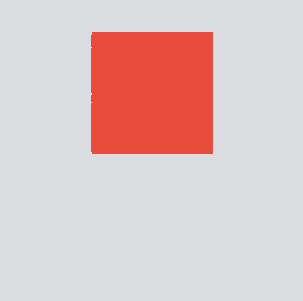

# Interaction and Animation Properties

交互与动画属性

这些设置特定于施加到层的动画和交互。这些被用来定义的条件，动画的范围和交互/动画的关系。

These settings are specific to the animations and interactions applied to the layer. These are used to define the conditions, ranges of an animation and interaction/animation relationships.

## Based On

依据

第一菜单设置动画将基于该层。一层必须有它的交互使它显示在此菜单中。我们建议保持图层名称简单明了，易于使用。

The first menu sets the layer the animation will be based on. A layer must have an interaction on it for it to show up in this menu. We suggest keeping layer names simple and clear for ease of use.

每个交互都有不同的事件和第二个菜单设置动画基础上的互动事件。取决于事件，其他动画属性和选项将变得可用或者被隐藏。

Each interaction has different events and the second menu sets the interaction event the animation is based on. Depending on the event, other animation properties and options will become available or be hidden.

一层有多个交互应用于它将显示所有可用选项。

A layer that has more than one interaction applied to it will show all options available.

这是交互事件的一个图表：

This is a chart of interaction events:

| 拖动	      |  位置  |  开始	 |  释放  |          |
| ----------- | :---------:| :---------: | :-------: | -------: |
| 点击	      | 点击	   | 	         |           |          |
| 双击         |       双击 |	 	 |           |          |
|长按          | 长按       |             |           |	        | 	
|旋转	      | 旋转        | 开始	 | 释放   |          |
|收缩	      | 收缩	   | 开始	 | 释放   |          | 
|滚动	      | 位置   | 开始	 | 结束	     | 释放  |
|*屏幕*     | 加载	   |             |           |          

| Drag | Position | Start | Release |  |
|------|:--------:|:-----:|:-------:|::|
| Tap | Tap |  |  |  |
| Double Tap | Double Tap |  |  |  |
| Long Press | Long Press |  |  |  |
| Rotate | Rotation | Start | Release |  |
| Pinch | Pinch | Start | Release |  |
| Scroll | Position | Start | End | Release |
| * SCREEN * | Loaded |  |  |  |

请注意，*屏幕*有一个选项，加载，当屏幕加载时，动画根据该选项记载。

Please note, * *SCREEN* * has one option, Loaded, which bases the animation on when the screen loads.

（拖动，旋转，捏和滚动）中多个事件互动被认为是恒定的，因为用户可以连续进行这种互动。

Interactions with more than one event (Drag, Rotate, Pinch and Scroll) are considered constant because the user can continuously perform this interaction.

## Animates

动画

有三种类型的动画模式，改变动画运行的过程。

There are three types of animation modes that change how the animation runs it’s course.

**CONTINUOUSLY TO FINAL VALUE**

像拖动和滚动持续的互动，图层平移，但有互动和动画范围的限制。

Layer moves in parallel with constant interactions like Drag and Scroll, but has limits for interaction and animation range.

**CONTINUOUSLY WITH RATE**

像拖动和滚动持续的互动，图层以规定的速度平移（即视差运动）。

Layer moves in parallel with constant interactions like Drag and Scroll, at defined rate. (i.e. parallax movement)

**WITH DURATION TO FINAL VALUE**

像拖动和滚动持续的互动，图层以规定的速度平移（即视差运动）。

Layer moves with duration, once a set condition is met.

某些交互事件只允许特定的动画类型，如下图所示的图表：

Certain interaction events only allow specific animation types, as shown in the chart below:

| 	|持续	|持续写入速率	|写入持续时间|
| ------|:----: | :-----------: |:--------: |
|位置    |	|               |           |
|开始	|	|               |           |
|释放    |	| 	        |           |
|结束	|	|               |           |
|单机/双击/长按|   |              |           | 	
|旋转/收缩|       |              |           |	

|  | Continuously | Continuously w/ rate | w/ Duration |
|--|--------------|----------------------|-------------|
| Position | [x] | [x] | [x] |
| Start |  |  | [x] |
| Release |  |  | [x] |
| End |  |  | [x] |
| Tap/Double Tap/Long Press |  |  | [x] |
| Rotation/Pinch | [x] | [x] | [x] |

## Anchors (Scale and Rotate)

锚点（缩放和旋转）

缩放和旋转动画的起源可以设置这个3x3的网格。点击的网格中的一个正方形，为该动画设置转折点。

The origin of Scale and Rotate animations can be set with this 3x3 grid. Clicking on one of the squares in the grid, sets the anchor for that animation.

缩放动画将从选定的点向上向下扩展。

Scale animations will scale up and down from the selected point.

旋转动画将绕着选定点旋转。

Rotate animations will pivot around the selected point.

## Transform Style (Rotate)

旋转的变换样式

这变化轴可用于切换动画。在默认情况下只显示Z轴领域。点击三维旋转显示X和Y轴。这允许card-flip类型的动画。

This toggle changes which axes are available for the animations. By default only the Z axis field is shown. Clicking on **3d Rotation** reveals X and Y axes. This allows for card-flip types of animations.

### X ROTATION

X 轴旋转

绕X轴旋转图层,按照正数带动底部向顶部翻转。

This rotates the layer around the X axis, animating a bottom to top flip with positive numbers.

### Y ROTATION

Y 轴旋转

绕Y轴旋转图层,按照正数带动左边向右边翻转。

This rotates the layer around the Y axis, animating a left to right flip with positive numbers.

### Z ROTATION

Z 轴旋转

绕Z轴旋转图层,按照正数顺时针旋转。

This rotates the layer around the Z axis, animating a clockwise spin with positive numbers.

## Backside Layer (Rotate)

旋转到背面

这个属性指定使用哪个层作为旋转层的背面。

This property designates which layer to use as the backside of the rotating layer.

默认情况下，没有层被选择并且旋转层的背侧被使用。选择一个图层用于这一属性，将使它成为图层的背面。在该图层列表中，可以是任何大小的该背面层，应定位关闭屏幕，并且必须是在旋转层下面。

By default no layer is chosen and the backside of the rotating layer is used. Choosing a layer for this property will make it the backside of the layer. This backside layer can be any size, should be positioned off screen and must be below the rotating layer, in the layer list.

