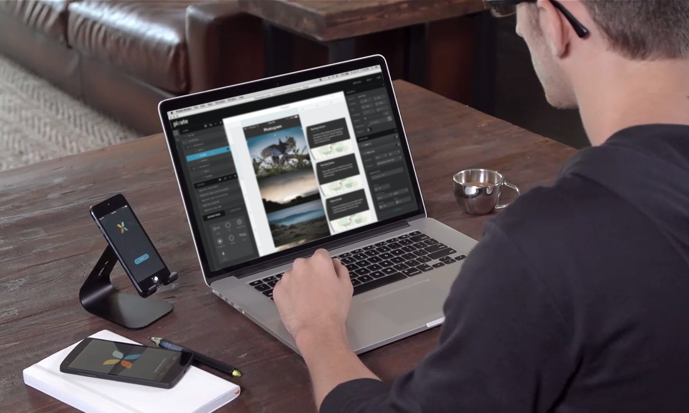

# 说明

Hi，看这里！我们是 Pixate。很高兴认识你。

## 它是什么

Pixate 是新一代的手机交互设计服务，目的是帮助设计师脱离代码就可以创建复杂的动画和交互。当设计的时候，平台将产生 100% 原生手机原型， 让你改善独特的体验和更好的与权益相关者和团队成员交流产品交互。

## 我为什么要使用它

你想要创建手机原型，让你表达完美匹配真实 App 交互和动画的想法。Pixate 让你能够快速的表达脑海中的想法，能够在你的手机设备上呈现，并能够快速迭代，这些都不需要写任何代码。当你能够确切的体验你的想法，就像它在真实环境使用一样，作为一个设计师，你将有深刻的影响，能减少流失，并让你能够更有效的和团队成员交流。

## 我需要什么

需要你的机智，先进的计算机，Pixate Studio，Web 浏览器和云服务账号（用来分享和云存储），一个 Android 或者 iOS 手机设备，和一个创造颠覆性 App 的计划。

## 让我们开始吧

我们这里会提供帮助。这个教程将帮助你开始使用 Pixate，并带你体验成为专家之路上需要的所有功能和组件。如果你没有在教程中找到你想要的，给我们反馈如何改善教程，或者有其他任何问题，请让我们[知道](feedback@pixate.com)。