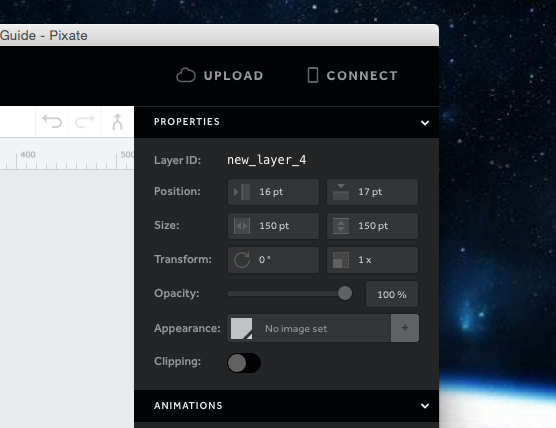
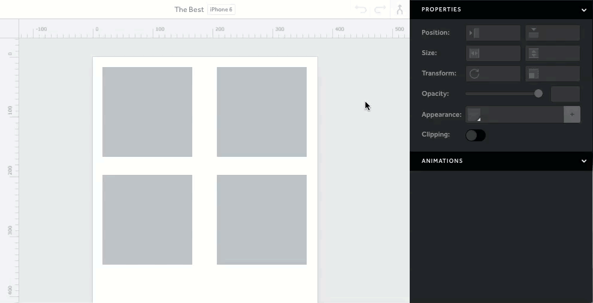

# 图层属性

这些设置属于所选层。您可以调整图层的位置，大小和方向，改变图层的外观。

## 图层标识

这是使用动画的条件。图层 **ID** 必须使用，图层名称将不被识别。

## 尺寸

修改后可以改变图层的高度和宽度。单位是像素点。

## 位置

修改后可以改变图层的 X 轴和 Y 轴的位置。单位是像素点。

## 旋转

修改后可以改变图层旋转的角度。旋转中心是图层的中心，单位是角度。

## 缩放

修改后可以改变图层的缩放比例。会等比例地增加高度和宽度。默认是 1 倍缩放大小。

## 透明度

修改后可以改变图层的透明度，范围从 0% 到 100%。默认是 0% 透明度，完全不透明。

## 颜色填充

选择一种颜色或输入 RBG 值来改变图层的填充颜色。

## 图像

通过点击 **+** 按钮添加一张存在的图片，用以填充图层。

## 裁剪

图层超出父级图层的部分，会对超出部分进行裁剪。

## 同时编辑多个图层

通过使用选中多个属性，可以同时修改多个图层的对应属性。调整属性是被应用到所选择的图层，但是对于添加的交互或者动画，是无效的。

