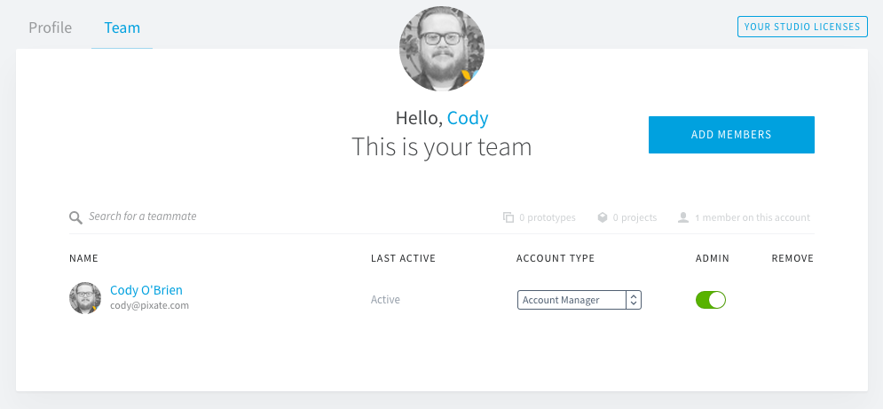
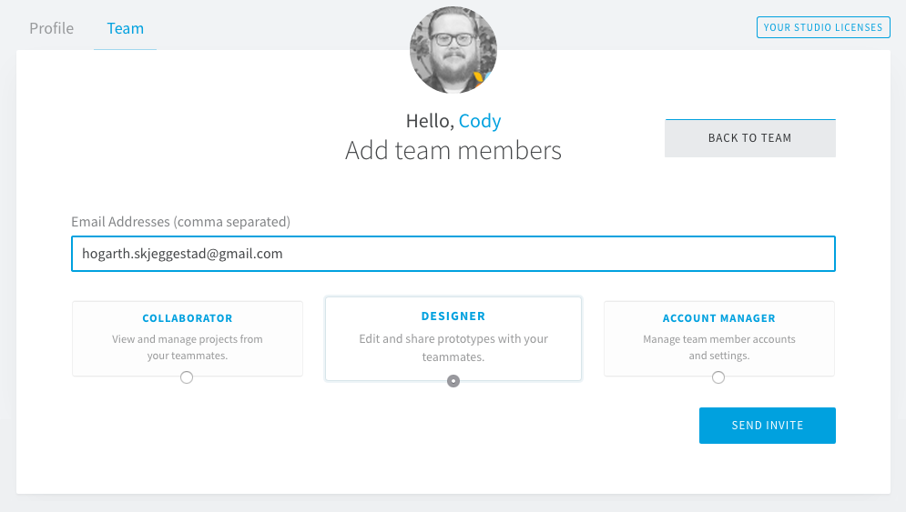
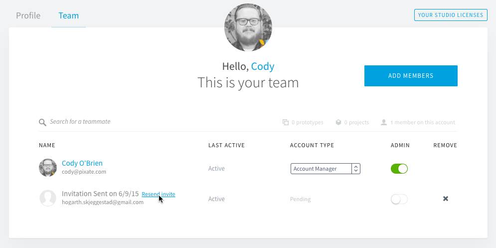
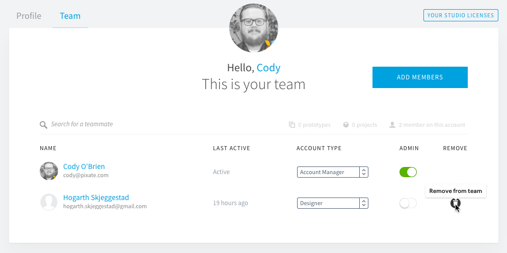
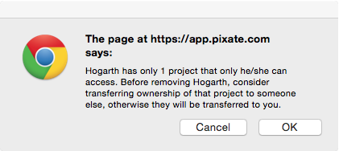

# 管理你的团队

在某些时候，您可能想把别人添加到您的账户上。他们可以是一个特定项目的设计团队或团队经理。本文将为您讲述邀请用户到您的账户，更改用户的角色和将一个用户的原型转移到另一个用户中。

### 邀请用户

只有账户的所有者和管理员才可以邀请新用户到账户上。如果您不是一个账户的所有者或管理员，您不会有这些选项可用。

在 Team 页面中，点击**添加用户**按钮。

*记住，您可以邀请任何一个您想邀请的电子邮件地址，但对于那个人的加入，他们不可以是在 Pixate 上已注册的用户。如果他们已经有一个账户，他们需要在加入前取消和删除他们目前的账户。*

输入一个或一些您想要邀请到账户上的电子邮件地址（以逗号隔开）。

选择您想要添加到账户上的用户角色。如果您添加多个用户，这些用户都将采用所选的角色，但这可以在之后更改。

*我们强烈建议添加用户作为最初的合作人员，因为这是一个免费的用户类型。如果您选择让他们成为设计人员，您将要为所有被添加的用户缴纳费用。*

角色影响了用户能在账户中做什么。这是一种途径去控制谁可以查看或编辑原型，用户和账户信息。

 - **设计人员** - 添加这种角色的用户将**增加您的订阅成本**。这种角色的用户可以创建，删除和编辑他们有权限的项目和原型。设计人员可以充分了解应用程序的原型特征。

 - **合作人员** - 添加这种角色的用户是免费的。这种角色的用户，他们只有项目和原型的只读权限。对于不需要进行编辑的客户或项目经理来说，合作人员角色是最理想的。

 - **客户经理** - 添加这种角色的用户是免费的。这种角色的用户，只能查看当前在账户上的用户列表和收费页面。客户经理的目的主要是监控和维护账户上的会员，以及收费信息。

一旦您选择了角色，就点击**发送邀请**按钮。被邀请人就会收到一封电子邮件，上面附有接受邀请的链接。再说一次，如果他们的电子邮件地址已在 Pixate 上注册过，他们是不能再加入到账户中的。他们需要先取消他们目前的账户。

您可以重新发送邀请邮件，将鼠标悬停在列表中的用户上并点击**重新发送邀请**链接。

### 编辑用户

一旦个人接受邀请并且注册，您可以查看那个用户可选的选项。

#### 更改角色

这个用户的下拉菜单，允许您去更改用户的角色和账户类型。这个能在任何时候修改并且立刻对用户产生影响。

#### 管理员权限

这个切换给了用户添加和移除其他用户，更改用户角色，授予管理员权限，将原型从一个用户转移到另一个用户和进入收费页面的能力。

任何一个用户拥有任何一种角色，都可以成为管理员。有一点需要注意的是，**客户经理**角色实际上是无用的，除非这个角色是一个管理员。由于这种角色是为用户管理账户的不同方面而设置的，因此，这些用户需要被设置为管理员去做这类工作。

#### 转让所有权

当前的账户所有者可以转让他们的所有权给另一个用户，通过把鼠标悬停在他们的名字上并点击**转让所有权**链接。这时，一个确认信息会弹出来，用以确保这是您想要做的操作。

### 移除用户

在列表明细中，通过点击垃圾桶按钮，用户能从账户中被移除出去（通过有管理权限的个人）。

如果用户拥有项目访问的唯一权限，那么这个消息将会弹出，警告您。这是一个机会让您可以收回权限并且准许其他用户访问这个项目，或者您可以接受，然后您去访问这个项目。在那里，您可以改变您认为合适的权限用户。

