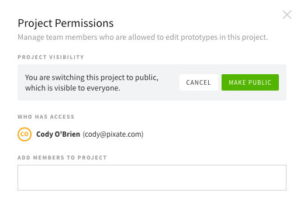

# 权限

权限允许你改变那些可以进入你的项目，创建和修改原型的人。单独的用户可以被添加和撤回，或者可以允许或禁止这个账号的所有用户进入项目。这对管理项目是很好的，可以确保用户只能进入他们需要工作的项目。

### 改变一个项目的可视性

为了改变以下的改变，你需要在一个项目的文件夹里面点击在**导入**旁边的按钮。

默认所有的项目都会被设为私有的。点击**使公开**的可视化选项可以让私有的项目变为公开的。

这里会提示你去确认你的改变，让你知道所有人是可以看到这个项目的。然后，点击**使公开**按钮。请记住，让项目变得公开代表删除了所有用户的访问权，因为现在每个人都可以看到它。如果你改变这个项目重新变为私有的，你将需要重新把用户加回去。

把公开的项目改变为私有的流程是一样的。点击**使私有**选项，通过点击绿色按钮表示确认。一旦项目是私有的，你将需要添加用户，让他们可以看到这个项目。

### 添加项目的用户

添加一个用户到一个私有的项目，输入它们的邮箱地址到**添加成员到项目**输入框。一个相关用户的列表会出现，这让添加用户变得容易。

一旦用户被添加了，他们会出现在**谁可以进入**列表下方。点击垃圾桶的图标会删除该用户进入的权利。请记住，你可以从进入列表中删除你自己。一旦你这样做了，你将会被踢出这个项目，不再能进入这个项目，直到你被别人再次添加回去。

请记住，至少要有一个用户可以进入这个项目。如果你已经是唯一一个用户可以进入这个项目的，你将不会有这个选项来删除你自己。

