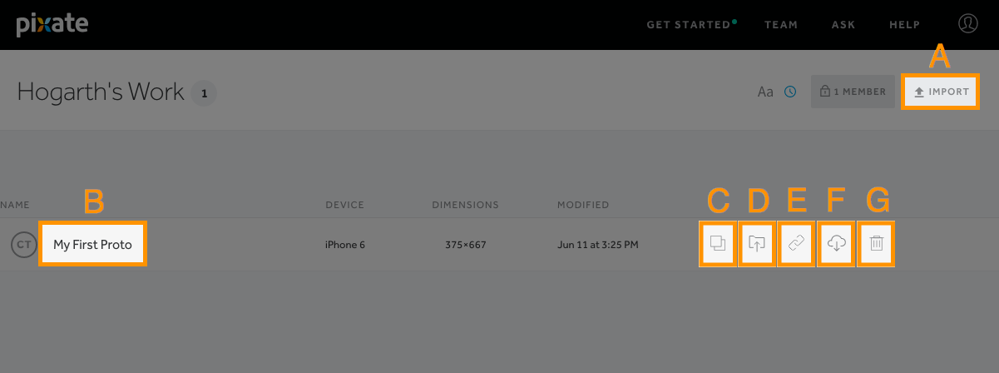
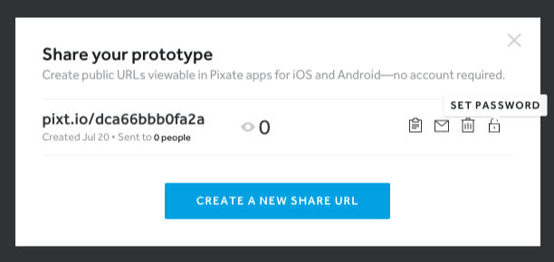
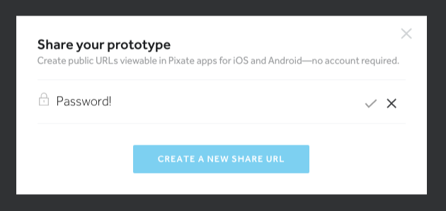
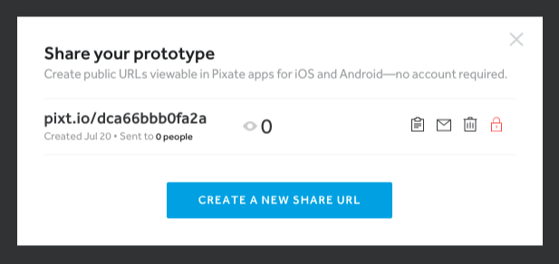

# 原型

本文会列出所有在项目内的原型。你可以按照最近更新日期或字母表的顺序来排序。每一个列表中的明细都显示了上传者，主要用于什么设备，它的尺寸，和它最后修改的时间是什么时候。

### A - 上传

Studio 文件（.pixate）可以被上传到云端，达到存储，团队协作，共享的目的。以下有三个途径上传一个原型：通过右上角的**输入**按钮，拖动和放置 .pixate 文件到页面中，或者直接通过 Studio。

### B - 重命名

要对列表中的原型进行重命名，**双击**原型的当前文件名即可。

### C - 复制

这个按钮会复制一个原型并且会把副本放置在同一个项目中。

### D - 移动

这个按钮把一个原型从当前项目，放到你所选择的另一个项目中。

### E - 共享

这个按钮生成一个共享 URL 让其他人访问。他们可以预览那些在设备上的原型。Pixate 移动应用程序需要用于预览原型。如果人们在不安装这个移动应用程序的前提下直接访问这个共享的 URL，就会即刻提醒去安装这个应用程序。

从对话框中，你可以复制这个 URL 到你的写字板中，通过电子邮件发送这个 URL，删除这个 URL，或者设置一个密码来访问这个 URL。

#### 申请密码

要申请密码，点击这个**开锁**按钮。

然后输入你想设置的密码，并且敲击一下**回车**或者点击绿色的检查按钮。密码就会显示为与你所输入的一致。

这个锁定的按钮现在显示为红色，并且锁定将会被关闭。如果要移除密码，只需要再次点击这个**锁定按钮**。

### F - 输出

这个会输出已上市的原型并且会把原型另存为 .pixate 文件，使其可以在 Studio 打开或者编辑。

### G - 删除

永久地从云端删除原型，你必须要非常确定这是你想要做的事。一旦删除原型后是无法恢复的。

