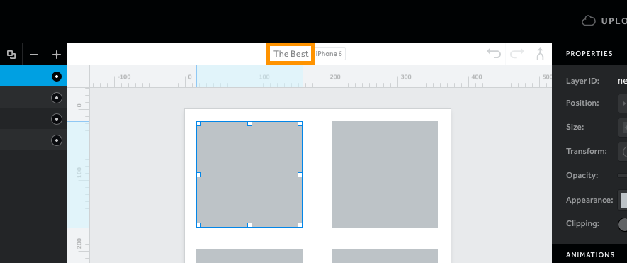
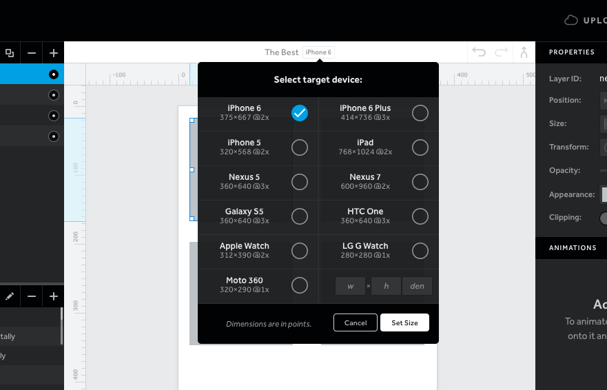
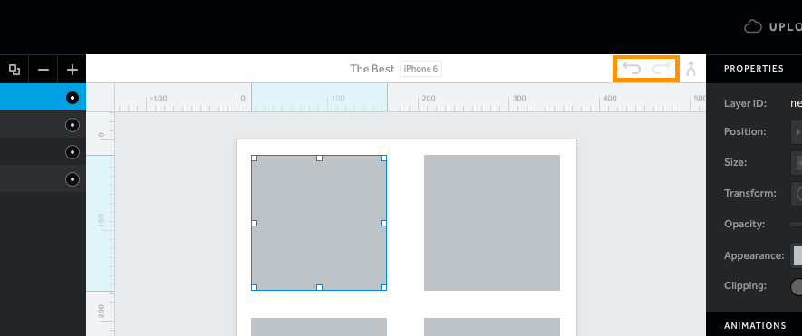
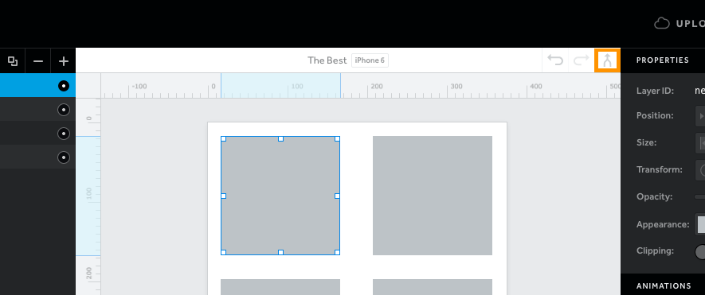

#The Canvas Menu

画布菜单

画布菜单（在画布顶端找到）拥有基础的工具和原型的信息。

The canvas menu (found at the top of the canvas) holds basic tools and info for your prototype.

##Name

命名

双击当前名字，重新命名你的原型。

Rename your prototype by double clicking on the current name.

##Device

设备

单击设备将允许您选择其他设备，输入自定义尺寸。

Clicking on the device will allow you to either choose another device or enter custom dimensions.

##Undo/Redo

撤销/重做

运行撤销重做最近 20 个操作。

Undo or redo the last 20 actions with these buttons.

##Merge

合并

合并功能允许您把另一个 `.pixate` 文件的图层，资源，动画和属性带到当前工作的 `pixate` 文件。这可以用来添加已经设置并保存常见的元素。如果有一个创建的菜单需要使用到整个原型，合并可以让你重用这个菜单，所以你不需要重建。

The merge feature allows you to bring the layers, assets, animations and properties of another .pixate file to the current one you're working on. This can be used to add common elements you've already set up and saved. If you have a menu you created and need to use throughout your prototypes, merge will let you bring that menu in, so you don't need to rebuild it.

