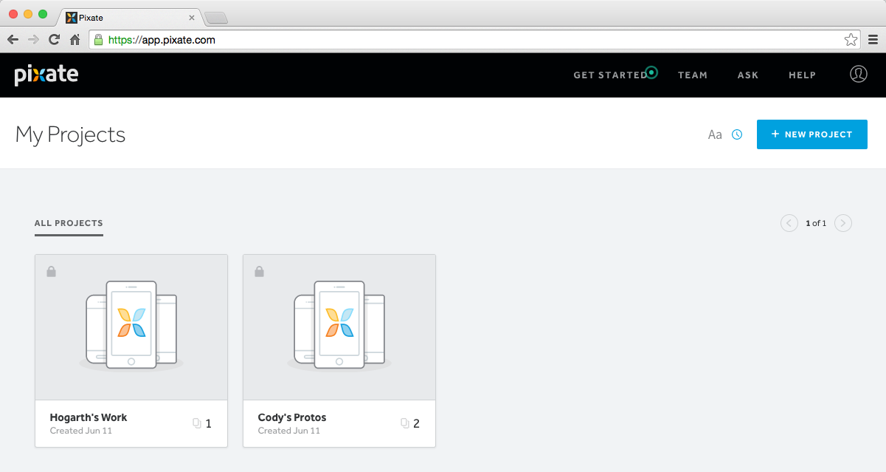
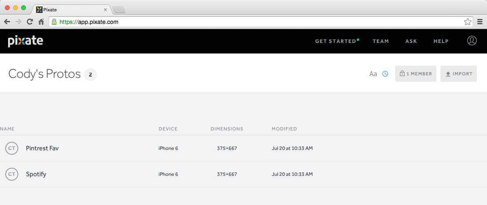
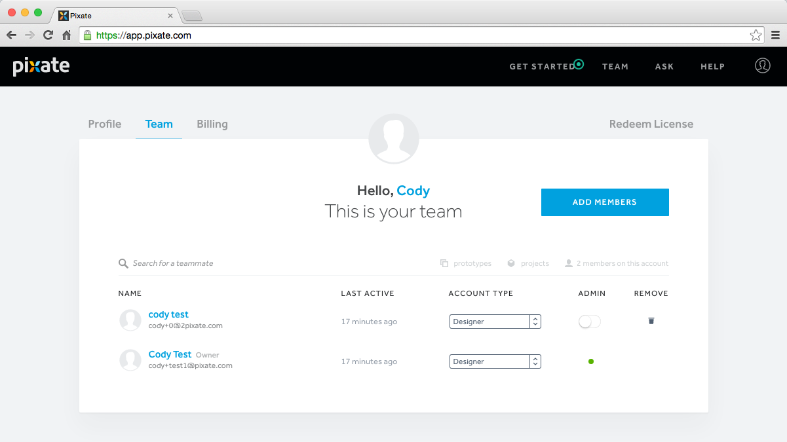
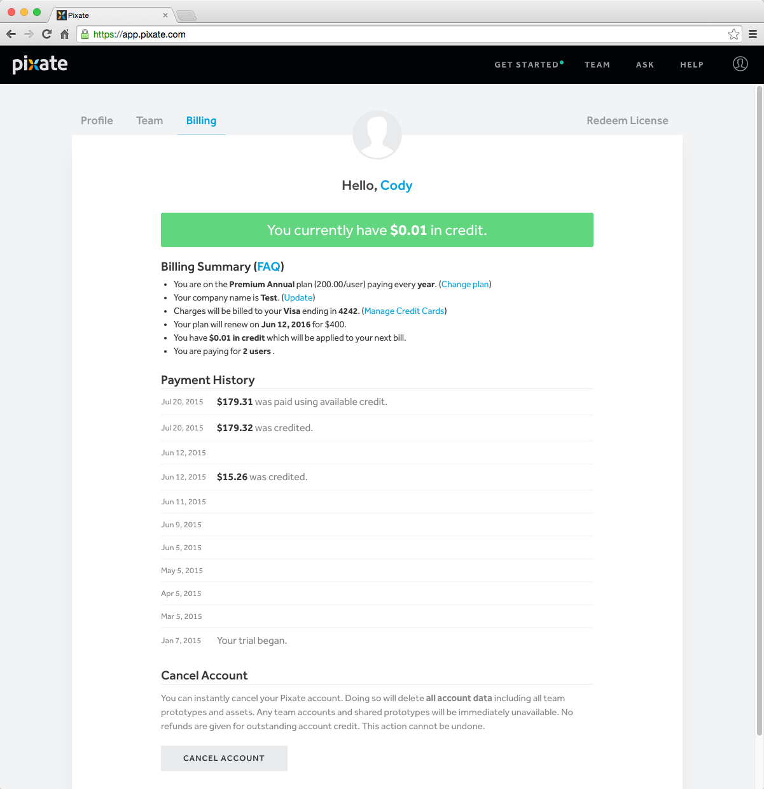

# 云端

*一个需要访问云端功能的介绍。*

这是一个 Pixate 储存和队伍管理的区域。你的云账号将容纳你所有的原型。它也将允许你把原型分享给其他人。这也是账号管理者可以进入队伍和账单管理的页面。

## 项目页面

项目是以文件夹的形式组织你独立的原型的。原型可以移进、移出这些文件夹，允许你按照需求要拖曳原型。你可以改变某些特别的项目的进入权限，或者开放它们给你的账户里的任何人去看。

更多的请查看[权限](http://help.pixate.com/knowledgebase/articles/665656-4a-permissions)

## 原型页面

在项目里的原型会被显示在这个页面。这是你可以移动、删除、分享和导出你的原型的地方。

更多请查看[原型](http://help.pixate.com/knowledgebase/articles/665659-4b-prototypes)

## 团队页面

这个页面是账号管理员可以增加、删除用户，修改用户角色，推荐和取消管理员的页面。

更多请查看[团队管理](http://help.pixate.com/knowledgebase/articles/665665-4c-managing-your-team)

## 账单页面

只有账号拥有者和账号管理者被标记成为管理员才可以进入账单页面。在这里，账单信息可以被更新，你的预约费用计划可以被改变和你的账号可以被取消。

更多请查看[账单](http://help.pixate.com/knowledgebase/articles/665668-4d-billing)