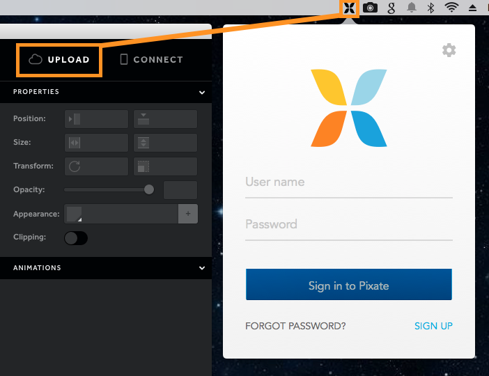
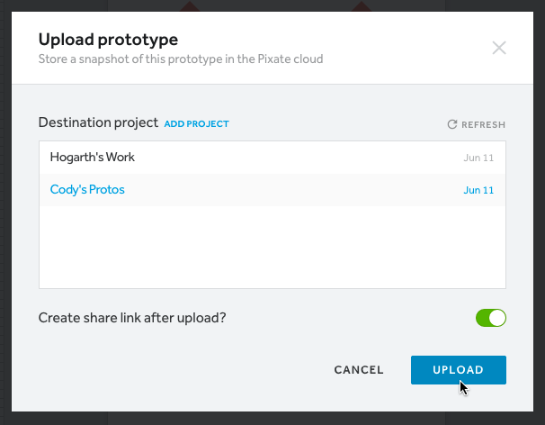

# Uploading and Sharing

上传与分享

如果你在和团队一起协作，或者只是想将近期版本的原型存储在网络上，就会需要使用到云服务。云服务可以上传原型的近期版本到你的 Pixate 账号上。在云端，你可以分享，移动，复制你的原型。这也是一种保护原型特定版本的一种方法。

If you're working with a collaborative team or you just want to store a current copy of your prototype online, you'll need to import it to the cloud. This process takes the current version of your prototype and uploads it to your Pixate account. From there, you can share, move and duplicate the prototype. This is also a way to keep specific versions of your prototype safe.

## How to import to the cloud

如何上传到云端

首先你要确定你是否有云服务的账号。如果没有，你可以在[这里](https://app.pixate.com/signup)创建一个。

First you'll want to make sure you have a cloud account setup. If don't have one, you can create one [here](https://app.pixate.com/signup).

登陆后我们就可以连接到你的账号。点击你系统菜单栏上的 **Pixate icon**，或者点击 Studio 右上方的 **Upload** 按钮，输入你的用户名和密码。

You'll need to sign in before we can connect you to your account. Click on either the **Pixate icon** in your OS's menu bar or click the **Upload** button in the upper right hand side of Studio and enter your cloud username and password.

返回到 Studio，再点击 **Upload** 按钮，它会提示选择你要上传的工程。如果账号里还没有工程的话，你可以点击 **Add Project** 链接创建一个。在创建新工程后，记得刷新 Studio 的工程列表

Back in Studio, click the **Upload** button again and you'll be prompted to select a project to upload the prototype to. If you don't yet have a project in your account, make sure you click the **Add Project** link to create one. Once you've created a new project, make sure to refresh the project list in Studio.

## How to share

如何分享

如果想为上传的原型生成一个分享链接，要确保在上传之前已经将分享选项勾上。

If you want to generate a share URL for the prototype you're uploading, make sure to mark the option and click the Upload button.

